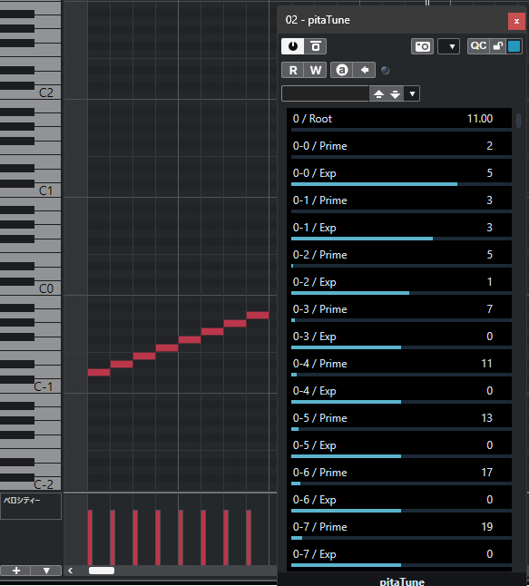

# pitaTune

## Q: これは？
A: [ODDSOUND](https://oddsound.com) が提供する統合チューニングシステム [MTS-ESP Library](https://github.com/ODDSound/MTS-ESP) を利用した MTS-ESP Master プラグインです。
MTS-ESP masterは MTS-ESP system が管理する MIDI ノートナンバーを周波数に変換する役割を持ちます。

## Q: 具体的に何が出来るの？
A: 以下の特徴があります。
1. 楽曲制作で微分音・純正律を採用する場合、正確な計算・調律ファイルへの変換・シンセサイザーへの適用と通常 3 ステップ必要になります。またシンセサイザーへ調律ファイルを適用する際、シンセサイザーを立ち上げるたび個別に適用・管理する必要があります。MTS-ESP system を採用する事でこれらを DAW で一括管理する事が可能となります。

2. このプラグインの目玉の機能は、素因数と指数の組み合わせから約数を求め、それを音列とするというアルゴリズムにあります。このアルゴリズムを採用する事で古典的な純正律から未知の周波数比を持つ和声の探索まで柔軟に対応する事が出来ます。

## Q: 動作環境は？
A: 以下の環境で開発しました。
- 最新の Windows 11
- VST3 規格に対応した DAW (Cubase 12, etc.)
- MTS-ESP system に対応したシンセサイザー (Serum, Diva, Repro, Pianoteq, DX7 V, etc.)  
→公式Webで[**対応製品一覧**](https://oddsound.com/usingmtsesp.php)を参照して下さい。

## Q: インストール方法は？
A: 以下の手順に従って下さい。
1. [libMTSWin_v1.02.exe](https://github.com/ODDSound/MTS-ESP/tree/main/libMTS/Win) もしくは [MTS-ESP MINI free](https://oddsound.com/mtsespmini.php) をインストールします。このステップは必須となります。
2. pitaTune.vst3 をダウンロードし C:\Program Files\Common Files\VST3 ディレクトリにコピーします。

## Q: プラグインが見当たらないんだけど？
A: カテゴリ: Instrument|Synth、メーカー: longlonglococo、プラグイン名: pitaTune を確認してください。

## Q: 使い方わからんちん(´・ω・`)
A: ルールを説明致します。
1. 8 種類の素因数(prime) と指数(exp)の組み合わせから約数列を作り、root と乗算した値が音列となります。
2. 計算された値は MIDI ノートナンバー 0 から順に MTS-ESP system の周波数テーブルに割り当てられます。
3. MTS-ESP に対応したシンセサイザーで音を確認します。

## Q: root が見当たらないんだけど？
A: エディターの右にあるスクロールバーを操作してみて下さい。

## Q: くわしく！
A: 例として一般的な純正律の音列を生成します。文書だけでは伝わり辛いので画像を添付します。

1. ここでは純正律を以下の周波数比を持つ音列と定義し、基準周波数を A = 440 Hz とします。  
{C(24), D(27), E(30), F(32), G(36), A(40), B(45)} 

2. 440Hz/A(40)=11 となるため root には 11 を入力します。

3. 上記で定義した音列の最小公倍数 4320 を素因数分解した以下の値をエディターに入力します。  
{{2,5},{3,3},{5,1},{0,0},  {0,0},{0,0},{0,0},{0,0},}

4. 自動的に以下の約数列が作られrootの値と乗算されます。  
{..., 24, 27, 30, 32, 36, 40, 45,...} * 11  
= {..., 220, 264, 297, 330, 352, 396, 440, 495,...}

5. そして C(24*11) に割り当てられた MIDI ノートナンバー 14 から順に演奏する事で純正律を再現する事が出来ました。

## Q: 音が出ないんだけどなんで？
A: pitaTune は MIDI 入力 として MIDI ノートナンバーを受け取ると、そのナンバーの値へプリセットを切り替えようとします。初期値を 0 と設定していますが、意図せずプリセットが切り替わっている可能性があります。

## Q: ライセンスどうなってるの？
A: 

## Q: 不具合報告と要望はどこに？
A: 
